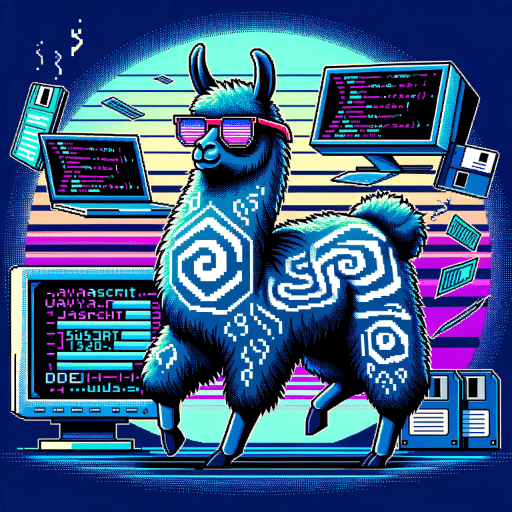

# Unofficial Ollama JS (browser & node) library
Ollama deserves a nice js wrapper. Ollama is an awesome piece of llama software that allows running AI models locally and interacting with them via an API. This API is wrapped nicely in this library.

Based on [ollama api docs](https://github.com/jmorganca/ollama/blob/main/docs/api.md) –
[commit](https://github.com/jmorganca/ollama/commit/f21bd6210d0d331ab94468791b4761e6bb5bc638)


### A simple wrapper for prompting the local ollama api.

- It is a wrap around fetch to make it easier to use the ollama api.
- It manages the context vector for continuous conversations.
- Use the stream or non-stream version of the prompt method to get the response.

### Works in node and the browser.

The only dependency (for node) is [node-fetch](https://www.npmjs.com/package/node-fetch)

If you use node v17.5.0+ and the node --experimental-fetch filname.js flag, you no longer need to install fetch (finally)

IIEF & ES6 modules are available for node and the browser.

## Installation

```bash
npm install ollama-js
```
## Via CDN

```html
<script src="https://cdn.jsdelivr.net/npm/ollama-js/browser/iife/ollama-js.global.js"></script>

<script type="module" src="https://cdn.jsdelivr.net/npm/ollama-js/browser/index.js"></script>
```

## Import the module

```js
// use in the browser as a type="module" or in node with modules enabled (mjs)
import Ollama from "ollama-js";

// use global in the browser with script tag
const Ollama = window.OllamaJS;
```

## The two questions

### 1. Stream or no stream

Depending on the use case, you can use the stream or non-stream version of the prompt method. If you don't mind waiting for the whole response, use the non-stream version. If you want to get the response in chunks, use the stream version.

### 2. Memory or no memory

Each prompt is a fetch request. The response (last response if stream) contains a context vector. The context vector is used to keep the conversation going. The context is sent with the next prompt request. The context is cleared with the clear method.

#### Take the contextwindow of the model into account

### Keep the conversation going

If you want to keep the conversation going with the context, you simple have to keep the reference to the instance.

```js
import Ollama from "ollama-js";
const instance = new Ollama({
  model: "llama2",
  url: "http://127.0.0.1:11434/api/",
});
instance.prompt("Hello my ai friend");
// instance will keep the context vector
```

### Who needs memory?

If you don't want to keep the context vector, you can just create a new instance for each prompt.

```js
import Ollama from "ollama-js";
const response = await new Ollama({
  model: "llama2",
  url: "http://127.0.0.1:11434/api/",
}).prompt("Hello my ai friend");
// context vector is lost
```

### No memory short sugar syntax

This is the shortest way to use the module. It will create a new Ollama instance and call prompt on it. It will not carry the context vector between calls, as the reference to the instance is lost.

## The From connection string is

```
<model> @ <url>
<model>@<url>
```

```js
const response = await Ollama.from("llama2@http://127.0.0.1:11434/api/").prompt(
  "Hello my ai friend"
);
console.log(response); // "I am not your friend, buddy."
```

## Basic constructor example

Add more options to the constructor to get more control over the instance.

```js
import Ollama from "ollama-js";

const response = await new Ollama({
  model: "llama2",
  url: "http://127.0.0.1:11434/api/",
  system: "system prompt to (overrides what is defined in the Modelfile",
  template:
    "the full prompt or prompt template (overrides what is defined in the Modelfile)",
}).prompt("Hello my ai friend");
```

## Continue conversation example

Keep the reference to the instance to carry the conversation vector (context) between calls.

```js
const Ollama = require('ollama-js');
const 🦙 = new Ollama({
    model:"llama2",
    url:"http://127.0.0.1:11434/api/"
})
const response = await 🦙.prompt("Hello my ai friend")
// next prompt will include the previous context vector
const next_response = await 🦙.prompt("That's funny")
// clear the context vector
🦙.clear()
```

## Stream example

Use the stream version of the prompt method to get the response in chunks.

```js
import Ollama from "ollama-js";
const 🦙 = new Ollama({
    model:"llama2",
    url:"http://127.0.0.1:11434/api/",
})
const responded = []
// callback will be called with response chunks until error or response.done is true
const on_response = (error,response) => {
    if (error) {
        console.error(error)
    }
    else if (response.done) {
        console.log(responded.join("\n"))
    }
    else {
        responded.push(response)
    }
}
🦙.prompt_stream("Hello",on_response)
```

## Abort request example

Abort the request by calling the abort method on the instance.

```js
import Ollama from "ollama-js";
const 🦙 = new Ollama({
    model:"llama2",
    url:"http://127.0.0.1:11434/api/",
})
let responded = ""
// callback will be called with response chunks until error or response.done is true
const on_response = (error,response) => {
    if (error) {
        console.error(error)
    }
    else if (response.done) {
        console.log(responded)
    }
    else {
        responded += response
        if (responded.length > 10) {
            // abort the request on silly grounds
            🦙.abort()
        }
    }
}
await 🦙.prompt_stream("Hello",on_response)
```

## Use in the browser

```html
<head>
    <script src="https://cdn.jsdelivr.net/npm/ollama-js/browser/iife/ollama-js.global.js"></script>
</head>
<body>
  <div id="output"></div>
  <textarea id="input"></textarea>
  <script>
    const Ollama = window.OllamaJS;

    function setup() {
        const input = document.getElementById("input")
        const output = document.getElementById("output")

        const 🦙 = new Ollama({
            model:"llama2",
            url:"http://127.0.0.1:11434/api/",
        })

        const on_response = (error,response) => {
            if (error) {
                console.error(error)
            }
            else if (response.done) {
                // done!
            }
            else {
                output.innerHTML += response
            }
        }

        input.addEventListener("keyup",async (event) => {
            if (event.key === "Enter") {
                await 🦙.prompt_stream(input.value,on_response)
                input.value = ""
            }
        })
    }
  </script>
</body>
```

# Extra features

---

## Use the expanded JSONparser

Getting JSON in return is awesome, but it is not always a pure JSON response, the JSONparser is a two step process, first it will try to parse the response as JSON, if that fails it will try to find the first valid json line and parse that until the end of a valid json object.

```js
import JSONparser from 'ollama-js/dist/node/JSONparser.js';
const 🦙 = new Ollama({
    model:"llama2",
    url:"http://127.0.0.1:11434/api/",
})
const response = await 🦙.prompt("create a JSON array of [{idea:string,description:string}]")
const json = JSONparser(response)
console.log(json) // [{idea:"create a JSON array",description:"of [{idea:string,description:string}]"}]
```

## Simple JSONStore

The JSONStore is a simple way to store and retrieve data from a file in node or localStorage in the browser. It is the basic storage requirement for exploring the ollama api and keeping some state.

```js
import JSONstore from 'ollama-js/dist/node/JSONstore.js';
const store = new JSONstore("store.json");
await store.load();

store.set("key", "value");

store.get("key"); // "value"

store.has("key"); // true

store.delete("key");

// append to appendable values
// arrays can be appended to
// objects can be merged
// strings can be concatenated
// numbers can be added
store.append("my_array", ["initial value"]);
store.append("my_array", ["next value"]);
console.log(store.get("my_array")); // ["initial value", "next value"]

store.append("my_object", { key: "initial value" }});
store.append("my_object", { another_key: "next value" }});
console.log(store.get("my_object")); // { key: "initial value", another_key: "next value" }

store.append("my_string", "initial value");
store.append("my_string", "next value");
console.log(store.get("my_string")); // "initial valuenext value"

store.append("my_number", 1);
store.append("my_number", 2);
console.log(store.get("my_number")); // 3

// always save the store to persist changes
await store.save();

// in the browser; download the store as a file
store.download();

// clear the store in memory
store.clear();

// destory the store file (truncates)
await store.destory();
```

In node it is just a JSON file on disk, in the browser it is stored in localStorage.